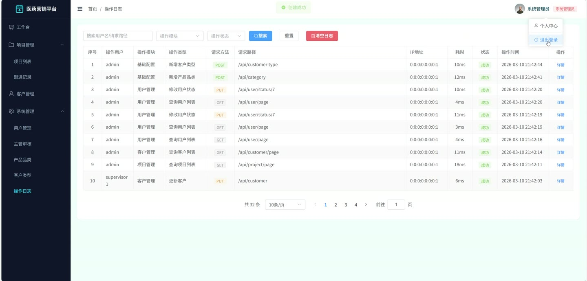
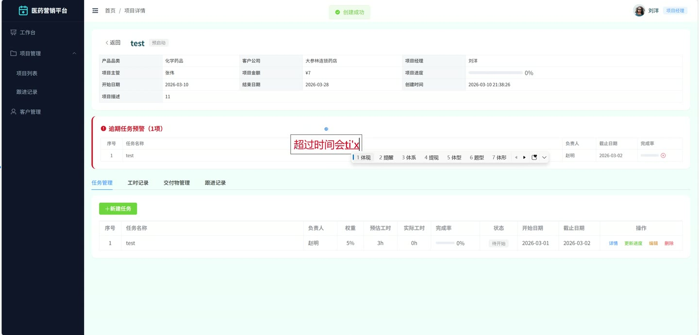
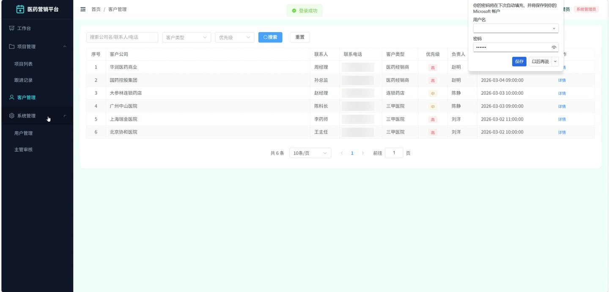
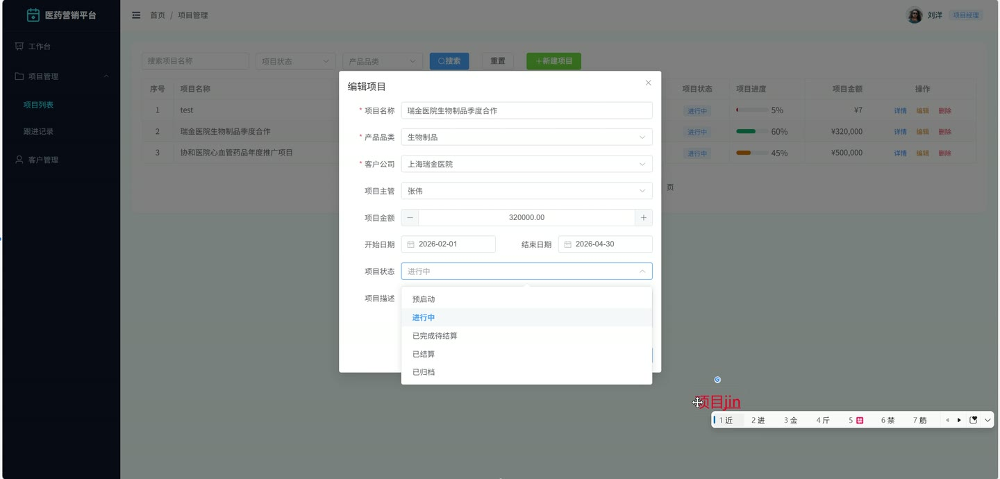

# (附文档)Springboot3+Vue3+MySQL 医药营销项目信息管理平台

**技术栈**：Springboot3、Vue3、MySQL

### 系统简介

医药营销项目信息管理平台采用 SpringBoot3 + Vue3 前后端分离架构，实现医药营销场景下项目全生命周期管理。系统内置系统管理员、项目主管、项目经理三种角色，涵盖客户管理、项目创建与跟踪、任务分解与进度计算、交付物归档、跟进记录、主管入驻申请审核、个人业绩看板等核心业务模块，为医药营销团队提供从客户开发到项目结算的一体化协作工具。
 
### 核心功能
 
### 项目经理端

 
- 查看个人负责的项目列表（支持按项目名称关键词、状态、品类、主管筛选） 
- 创建新项目时填写名称、产品品类、客户公司、项目主管、描述、起止日期、预算、签约金额等字段 
- 修改项目基本信息（名称、状态、日期、金额等） 
- 删除不再维护的项目 
- 将已完成或已结算的项目归档（状态变为 ARCHIVED） 
- 查看项目详情（含关联的品类名称、客户名称、项目经理姓名、主管姓名） 
- 查看首页看板统计：项目总数、进行中项目数、已完成项目数、签约总金额、各状态项目数量分布 
- 查看个人业绩数据：负责项目总数、已签约项目数、签约总金额、进行中项目数、含进度的项目列表 
- 管理客户信息：新增客户时填写名称、类型、联系人、电话、邮箱、地址、采购需求、合作历史、优先级、负责人 
- 分页查询客户列表（支持按关键词、客户类型、负责人筛选） 
- 修改客户信息、删除客户、查看客户详情（含类型名称和负责人姓名） 
- 管理项目任务：新增任务时填写名称、描述、负责人、权重、预估工时、开始日期、截止日期 
- 修改任务信息、删除任务 
- 更新任务完成比例（自动同步更新项目整体进度 = ∑(任务完成比例 × 任务权重)） 
- 查看任务列表（按项目筛选），查看逾期任务列表 
- 记录任务工时：添加工时记录时填写工时、工作日期、描述 
- 分页查询工时记录（按任务、项目、用户筛选） 
- 上传项目交付物：新增交付物时选择类型（合同扫描件/拜访记录/调研报告/其他）、上传文件（支持图片和文档） 
- 分页查询交付物列表（按项目、类型筛选），删除交付物 
- 记录跟进记录：新增时填写项目、客户、跟进内容、跟进时间、下一步计划 
- 分页查询跟进记录（按项目、客户、跟进人筛选），修改、删除跟进记录 
- 修改个人资料（真实姓名、手机号、邮箱、头像） 
- 修改登录密码（需验证旧密码）
 
### 项目主管端

 
- 提交入驻申请：填写真实姓名、手机号、邮箱、公司、资质文件 
- 查看个人负责的项目列表（按项目名称关键词、状态、品类、项目经理筛选） 
- 查看项目详情（含关联信息） 
- 查看首页看板统计：项目总数、进行中项目数、已完成项目数、签约总金额、各状态项目数量分布 
- 管理项目任务：新增、修改、删除任务，更新任务完成比例 
- 查看逾期任务列表 
- 记录任务工时：添加工时记录、查看工时记录列表 
- 上传项目交付物、查看交付物列表 
- 记录跟进记录、查看跟进记录列表 
- 修改个人资料、修改登录密码
 
### 管理员端

 
- 分页查询用户列表（支持按关键词、角色筛选，不显示管理员自身） 
- 查看用户详情、修改用户信息（真实姓名、手机号、邮箱、角色、状态） 
- 启用或禁用用户（修改用户状态 0-禁用 / 1-正常） 
- 删除用户 
- 分页查询项目主管入驻申请列表（按状态筛选：待审核/通过/拒绝） 
- 审核入驻申请：通过时自动创建主管账号（用户名=手机号，默认密码 123456） 
- 拒绝申请时填写拒绝原因 
- 管理客户类型：新增时填写名称、描述、排序号、启用状态 
- 分页查询客户类型列表（按关键词筛选），修改、删除类型 
- 管理产品品类：新增时填写名称、描述、排序号、启用状态 
- 分页查询产品品类列表（按关键词筛选），修改、删除品类 
- 管理系统配置：新增配置键值对，修改配置值，删除配置 
- 查看操作日志列表（支持按关键词、用户名筛选）
 
### 技术栈

 后端框架Spring Boot 3.x ORMMyBatis-Plus（BaseMapper + IService） 权限认证JWT（自定义注解 @OperLog + 拦截器） 前端框架Vue 3 状态管理Vuex / Pinia（前端路由管理） 构建工具Vite 数据库MySQL 8.x（逻辑删除 + 自动填充） 文件上传MultipartFile（按日期分目录存储） 定时任务Spring @Scheduled（每日凌晨检测逾期任务）
 
### 交付内容

 
- 后端完整源码 
- 前端完整源码 
- 数据库初始化脚本 
- 万字文档

## 界面展示

---

## 获取完整源码 + 万字文档

本仓库为项目介绍页。**完整前后端源码、数据库初始化脚本、万字项目文档**，请加微信 `kangkangcode`，或访问 [codekk.top](http://codekk.top) 获取。

可作课程设计 / 毕业设计参考，支持远程部署调试。